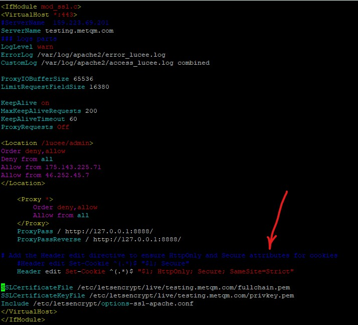
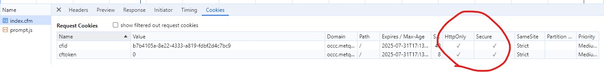

Security Hardening Add-on for FMS ( SH2024-002 )
======

** Adding HTTP security headers 

A) Apache server 
------

1. Open the Apache configuration file

for Ubuntu:
``$ vi /etc/apache2/conf-enabled/security.conf``

for Fedora:
``$ vi /etc/httpd/conf/httpd.conf``

2. Add headers to the config file

- Header always set X-XSS-Protection: "1; mode=block"
- Header always set X-Content-Type-Options: "nosniff"
- Header always set X-Frame-Options: "SAMEORIGIN"
- Header always set Content-Security-Policy: "default-src 'self'"
- Header always set Referrer-Policy: "strict-origin-when-cross-origin"
- Header always set Strict-Transport-Security: "max-age=31536000; includeSubDomains; preload"

 

3. Save and close the configuration file
4. Restart the Apache server

- sudo service httpd restart

B) Tomcat Server 
------
**Secure Apache from Cross-Site Scripting (XSS)**
One effective method to safeguard your Apache web server against XSS attacks is through the implementation of the `X-XSS-Protection header. This approach is both straightforward and robust.

Editing the Configuration File: Navigate to your Apache configuration file. This file is typically located at /etc/httpd/conf/httpd.conf for Apache installations on Linux or /etc/apache2/conf-enabled/security.conf for other configurations.
Setting the X-XSS-Protection Header: Add the following line to the configuration file:

Header always set X-XSS-Protection "1; mode=block"

This line of code instructs the server to always set the X-XSS-Protection header. The value “1; mode=block” activates the XSS Filter built into most modern web browsers.

Saving the Configuration File: After adding the line, save the file and close the editor.
Effect of the Settings: With these settings enabled, if a cross-site scripting attack is detected by the browser, it will attempt to sanitize the page, neutralizing the malicious script. Furthermore, in more severe cases, it may prevent the rendering of the page altogether to safeguard the user’s data and privacy.
Restarting Apache: To apply the changes, restart the Apache service. This can typically be done using a command like sudo systemctl restart apache2 on most Linux distributions.

or do in tomcat 
ref : https://support.ptc.com/help/arbortext/r8.2.1.0/en/index.html#page/PE/peinstall/pe2095.html

Enabling Secure HTTP Header in Apache Tomcat 8.5
Secure HTTP Headers provide protection against Cross-Site Scripting (XSS) attacks, cross-site request forgery, and other unauthorized actions.
To enable secure HTTP Header in Apache Tomcat, PTC recommends following steps. These steps will set the following:
• X-Frame-Options: DENY
• X-Content-Type-Options: nosniff
• X-XSS-Protection: 1; mode=block
* 
It is recommended to take a backup of any configuration file before making changes in it.
1. Open <Tomcat install directory>\conf\web.xml in a text editor.
2. Uncomment the following filter (by default, it is commented):
<filter>
	<filter-name>httpHeaderSecurity</filter-name>
   <filter-class>org.apache.catalina.filters.HttpHeaderSecurityFilter</filter-class>
        async-supported>true</async-supported>
</filter>
3. Add the following immediately after the above filter:
<filter-mapping>
    <filter-name>httpHeaderSecurity</filter-name>
    <url-pattern>/*</url-pattern>
</filter-mapping>
4. Save web.xml.

Set session cookies to secure
------

We can set at the application level using :

<cfset sessionCookie = { httpOnly=true, secure=true }>
<cfapplication ... sessionCookie="#sessionCookie#">

Sometimes its difficult to get CFM server to issue secure cookies, we can do it at apache server as follows :

in /etc/apache2/sites-available/domainname-le-ssl.conf

## Add the Header edit directive to ensure HttpOnly and Secure attributes for cookies
    Header edit Set-Cookie ^(.*)$ "$1; Secure"
    or
    Header edit Set-Cookie ^(.*)$ "$1; HttpOnly; Secure; SameSite=Strict"

Ensure mod_headers is Enabled: Verify that mod_headers is enabled.

.. tip::
   sudo a2enmod headers
   sudo systemctl restart apache2

